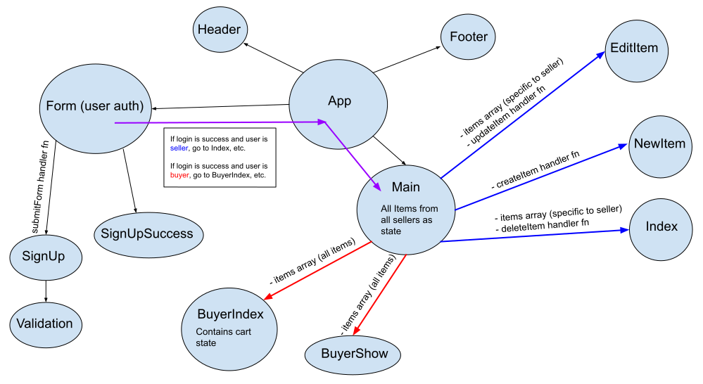

# Project 3 (Front-end)
## by Jameson Wang, Lucy Liu, & Nathan Noack

## Explanation of App
With so much waste in the modern era, from the plethora of restuarants tossing out tons of food, and also for those looking to save some money on food costs--whether it's a struggling small business or a hungry family--this app aims to solve both of those problems by creating a central shopping network for which those two roads to connect. Pulling from from our collective backgrounds in the restaurant and retail industries, we strive to use the power of the web, with the web development knowledge that we now have, to bring these people closer together for the betterment of both.

At its core, this is a custom e-commerce app, built from the ground up, where users must create an account, and depending on whether that user is a seller (restaurant) or buyer, they will be routed to different pages. A seller will be routed to their specific items for sale and be able to create/read/update/delete those items. On the other hand, a buyer will be routed to an index of all items and be able to add items to their cart or click on an item to see more specific details about that item as well as seller (restaurant) contact info.

[Backend repo](https://github.com/underdoggum/seir_penguin_project_3_backend)\
[Deployed frontend](https://unwasted.netlify.app/)\
[Deployed backend](https://unwasted-penguins.herokuapp.com/)

## Technologies Used
- React
- Express
- Node
- React-Bootstrap
- HTML

## Libraries/Techniques
- React Router
- Front-end CRUD functionality
- JWT User Authentication/Authorization
- Backend API Deployment with Heroku
- Frontend React Deployment with Netlify

## Intended Component Tree

## React Routing Table 

#### Main
| Action         | Path                        | Request   | Purpose                                                                        |
|:--------------:|:---------------------------:|:---------:|:------------------------------------------------------------------------------:|
| Index          | /items                      | GET       | List all items for a specific seller user                                      |
| Show           | /items                      | GET       | Show details about a specific item selected within the list of sellers' items  |
| Edit           | /editItem/:id               | PUT       | Edit the item that was selected in the sellers' index                          |
| Delete         | /items                      | DELETE    | Delete the item selected within the sellers' index                             |
| Create         | /newItem                    | POST      | Create an item to add to the sellers' index                                    |
| Index          | /allItems                   | GET       | Display all items from all sellers                                             |
| Show           | /showItem/:id               | GET       | Display info about a specific item from any seller                             |

#### User Authentication/Authorization
| Action                   | Path      | Purpose                                                                            |
|:------------------------:|:----------|:----------------------------------------------------------------------------------:|
| Reroute if not logged in | /*        | Reroutes users to the Home page (to sign up or log in) if not logged in            |
| Signup                   | /signup   | Allows users to sign up and choose whether they're a buyer or seller               |
| Signup                   | /login    | Allows users to login, then they're routed to Index (seller) or BuyerIndex (buyer) |

## User Stories
- Users can create an account (as either a seller or a buyer) or log in
- For sellers, once logged in, they will be taken to a dashboard of their items
  - Sellers will be able to create, read, update, or delete their items
- For buyers, once logged in, they will be taken to an index page of all items from all sellers
  - Buyers will be able to add items to their cart, view their cart, and delete items from their cart
  - Buyers will be able to click on an item and see a show page with that item's specific info

## Challenges
- One major challenge involved determining the scope of work to be accomplished within the project's timeframe. We had to refactor many of the cool features we originally wanted to implement in a way that had us reach MVP with our app first, and only then tack on additional functionality to ensure that we, at the minimum, reached MVP and allowed time for bug-fixing.

- Having been unfamiliar with collaborating using Git, the process of side-stepping merge conflicts was rough in the beginning of this project. However, with more practice and meetings to discuss how to best implement our process, we soon found a comfortable workflow which allowed us the flexibility to effectively pull together each others' code without much trouble.

- We struggled to figure out how to use the user's data type (buyer or seller) to determine where to route them after logging in. Then we realized that the backend should be responsible for sending the user data, so the frontend would only need to fetch this data to conditionally determine what route the user would go to after logging in.
